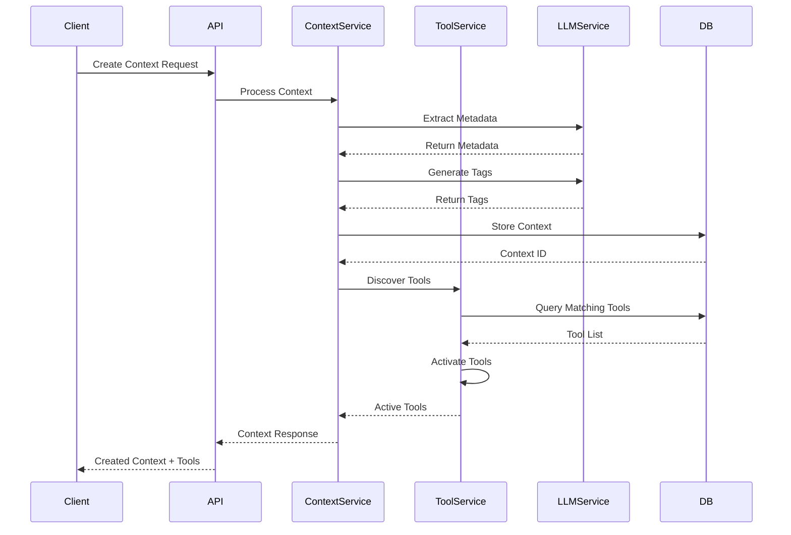

# Context Management System

## Overview
The Context Management System is a sophisticated platform designed to handle dynamic context-aware tools and content generation. It specializes in managing and improving context-based operations, with a particular focus on document generation and tool automation.

## Architecture

### Core Components

1. **Context Management**
   - Handles context creation, storage, and retrieval
   - Manages context metadata and quality metrics
   - Provides context improvement capabilities

2. **Tool Management**
   - Dynamic tool registration and activation
   - Tool-context matching system
   - Automated tool discovery and activation

3. **LLM Integration**
   - Integrates with OpenRouter for AI capabilities
   - Handles context improvement and analysis
   - Provides metadata extraction and tagging

### System Architecture

```
├── app/
│   ├── api/               # API endpoints
│   │   ├── contexts.py    # Context management endpoints
│   │   └── tools.py       # Tool management endpoints
│   ├── core/             # Core system components
│   │   ├── config.py     # Configuration management
│   │   ├── database.py   # Database connections
│   │   └── mcp.py        # Model Context Protocol
│   ├── models/           # Data models
│   │   ├── context.py    # Context data models
│   │   └── tool.py       # Tool data models
│   ├── services/         # Business logic
│   │   ├── context_service.py   # Context operations
│   │   ├── tool_service.py      # Tool operations
│   │   └── llm_service.py       # LLM integration
│   └── main.py          # Application entry point
```

## Workflow Architecture

### Context Creation Flow
1. **Input Reception**
   - System receives context creation request
   - Validates input data and metadata

2. **Context Processing**
   - Extracts metadata using LLM
   - Generates suggested tags
   - Assesses quality metrics

3. **Tool Integration**
   - Auto-discovers relevant tools
   - Activates matching tools
   - Associates tools with context

### Tool Management Flow
1. **Tool Registration**
   - Receives tool registration request
   - Validates tool metadata and capabilities
   - Stores tool configuration

2. **Tool Activation**
   - Matches tools with contexts
   - Handles activation rules
   - Manages tool lifecycle

### Context Improvement Flow
1. **Quality Assessment**
   - Evaluates context completeness
   - Checks accuracy and relevance
   - Measures clarity metrics

2. **Improvement Process**
   - Generates improvement suggestions
   - Applies context enhancements
   - Updates quality metrics

## Example: Employment Contract Generation

### Sequence Diagram


### Workflow Steps
1. **Context Creation**
   ```python
   contract_context = {
       "content": "Generate employment contract...",
       "content_type": "ai_tools",
       "tags": ["employment", "contract", "legal"],
       "metadata": {
           "locale": "sv-SE",
           "type": "employment_contract"
       }
   }
   ```

2. **Tool Registration**
   ```python
   contract_tool = {
       "metadata": {
           "name": "Contract Generator",
           "capabilities": ["contract_generation"]
       },
       "activation_rules": {
           "content_type": "ai_tools"
       }
   }
   ```

3. **Context Processing**
   - System automatically:
     - Extracts metadata
     - Suggests relevant tags
     - Activates matching tools
     - Improves content quality

## Setup and Configuration

### Prerequisites
- Python 3.8+
- MongoDB
- OpenRouter API access

### Environment Variables
```env
MONGODB_URI=mongodb://localhost:27017/context_db
OPENROUTER_API_KEY=your_api_key
OPENROUTER_BASE_URL=https://openrouter.ai/api/v1
PORT=8000
ENV=development
```

### Installation
```bash
# Clone repository
git clone https://github.com/your-repo/context-management.git

# Install dependencies
pip install -r requirements.txt

# Start server
uvicorn app.main:app --reload
```

## API Documentation

### Context Management

#### Create Context
```http
POST /api/contexts/
Content-Type: application/json

{
    "content": "string",
    "content_type": "string",
    "tags": ["string"],
    "metadata": {}
}
```

#### Improve Context
```http
POST /api/contexts/{context_id}/improve
```

### Tool Management

#### Register Tool
```http
POST /api/tools/register
Content-Type: application/json

{
    "metadata": {
        "name": "string",
        "version": "string"
    },
    "capabilities": ["string"],
    "activation_rules": {}
}
```

#### Get Active Tools
```http
GET /api/tools/active/{context_id}
```

## Testing

The system includes comprehensive tests covering:
- Context creation and management
- Tool registration and activation
- Context improvement workflows
- Integration testing

Run tests using:
```bash
pytest test_api.py -v
```

## Error Handling

The system implements robust error handling:
- Input validation
- Database connection management
- API error responses
- Tool activation failures

## Performance Considerations

- Asynchronous operations for improved scalability
- Efficient database queries
- Caching mechanisms
- Tool activation optimization

## Security

- Environment-based configuration
- API key authentication
- Input validation and sanitization
- Secure database connections

## Future Enhancements

1. Enhanced context analysis
2. Advanced tool matching algorithms
3. Multi-language support expansion
4. Machine learning integration
5. Performance optimization

## Contributing

1. Fork the repository
2. Create a feature branch
3. Commit changes
4. Push to the branch
5. Create a Pull Request

## Model Context Protocol (MCP)

The Model Context Protocol (MCP) is a key feature that enables extensibility through tool integration.

### MCP Overview
- Standardized protocol for tool-context communication
- Enables dynamic tool registration and activation
- Supports custom tool development and integration

### Creating MCP Tools
1. **Tool Definition**
   ```python
   {
       "metadata": {
           "name": "Custom Tool",
           "version": "1.0.0",
           "capabilities": ["custom_processing"]
       },
       "requirements": {
           "cpu": "1",
           "memory": "512Mi"
       },
       "activation_rules": {
           "content_type": "custom_type",
           "tags": ["specific_tag"]
       }
   }
   ```

2. **Tool Implementation**
   - Implement required interfaces
   - Define activation logic
   - Handle context processing

3. **Tool Registration**
   - Register tool with the system
   - Define matching rules
   - Configure auto-activation

### MCP Integration Example
```python
from app.core.mcp import MCPTool

class CustomTool(MCPTool):
    async def process_context(self, context):
        # Custom processing logic
        result = await self.custom_processing(context.content)
        return result

    async def activate(self, context):
        # Activation logic
        if self.matches_context(context):
            return await self.setup()
        return False
```

## License

This project is licensed under the MIT License - see the LICENSE file for details.
